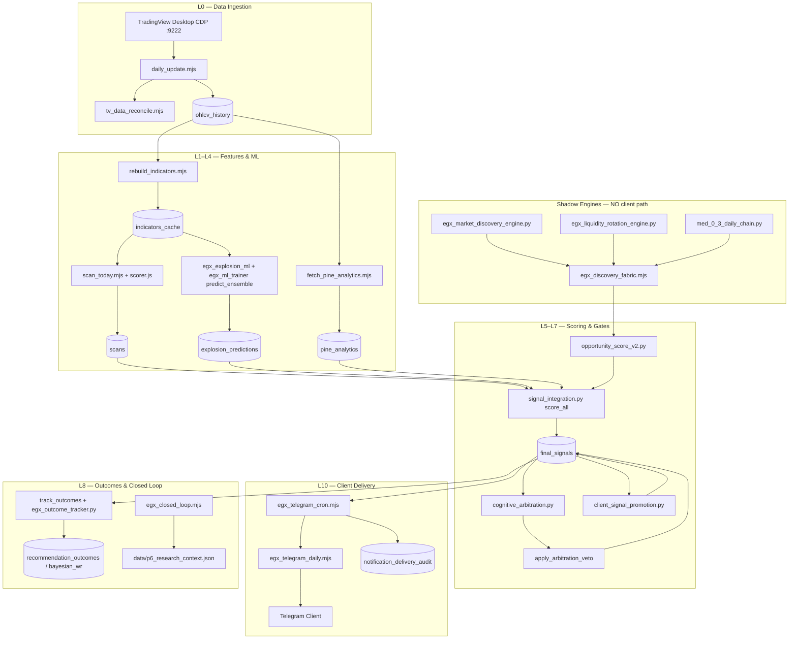

# EGX Platform — System Map (Phase 1 Audit)

**Audit date:** 2026-06-15  
**Auditor role:** Chief System Auditor / Backend / Quant Reliability / DevOps / Security  
**Method:** File inspection, DB queries, script tracing, command inventory — no assumptions  
**Scope:** Full end-to-end platform from TradingView CDP → SQLite → signal engines → Telegram delivery

---

## 1. Executive Summary

This repository is a **dual-purpose platform**:

| Subsystem | Purpose | Entry point |
|-----------|---------|-------------|
| **TradingView MCP** | 68 CDP tools to read/control TradingView Desktop | `src/server.js` (stdio MCP) |
| **EGX Quant Ops** | Egyptian Exchange daily pipeline: ingest → score → gate → deliver | `scripts/egx_tv_auto_update.mjs` |

**Single source of truth for client recommendations:** `final_signals` where `actionable=1`.  
**Shadow/research engines (LRE, MDE, MED)** are wired with explicit env flags and must not reach client path unless promoted.

### Live evidence snapshot (queried 2026-06-15)

| Metric | Value | Source |
|--------|-------|--------|
| DB file | `data/egx_trading.db` (~816 MB) | `du -sh` |
| OHLCV symbols | 269 | `SELECT COUNT(DISTINCT symbol) FROM ohlcv_history` |
| OHLCV bars | 81,446 | same |
| Latest OHLCV bar | 2026-06-14 | `MAX(bar_time)` → unix 1781420400 |
| `indicators_cache` rows | 3,080 | SQLite |
| `discovery_atom_registry` atoms | 420 | SQLite |
| `notification_delivery_audit` rows | 115 | SQLite |
| Latest actionable signals | 4 on 2026-06-11 | `final_signals` |
| Applied migrations | 001–007 (all) | `schema_migrations` |
| Top-level `.mjs` scripts | 191 | `find scripts -maxdepth 1` |
| Python scripts | 234 | `find scripts/python -maxdepth 1` |
| `data/*.json` artifacts | 257 | filesystem |
| Log files | 82 | `logs/*.log` |
| JS/Python tests | 50 files | `tests/` |
| npm `egx:*` commands | ~400+ | `package.json` scripts |

---

## 2. Architecture Topology



**Canonical layer registry:** `docs/LAYER_REGISTRY.md` + `scripts/lib/architecture_layers.mjs` (L0→L11)

---

## 3. Repository Layout

```
tradingview-mcp-jackson/
├── src/                    # MCP server + EGX core modules
│   ├── server.js           # MCP stdio entry (68 tools)
│   ├── cli/                # `tv` CLI commands
│   ├── core/               # CDP: chart, data, pine, replay, health
│   ├── tools/              # MCP tool handlers
│   └── egx/                # EGX: database, scorer, tv_bridge, python_bridge
├── scripts/                # 191 top-level automation scripts (.mjs)
│   ├── lib/                # 42 shared libraries (gates, audit, calendar, etc.)
│   ├── migrations/         # 7 SQL migrations + migrate.mjs
│   ├── python/             # 234 Python engines
│   └── pine/               # Pine Script sources
├── data/                   # SQLite DB + 257 JSON state artifacts
│   ├── egx_trading.db      # Primary database (816 MB)
│   ├── cards/              # Telegram card assets
│   ├── cognition_archive/  # Cognition snapshots
│   ├── knowledge_base/     # Structural laws / research KB
│   ├── liquidity_snapshots/
│   ├── models/             # Runtime model copies
│   ├── parquet/            # DuckDB export layer
│   └── research_reports/
├── logs/                   # 82 cron/pipeline log files
├── tests/                  # 50 test files (JS + Python)
├── docs/                   # 37 operational + research contracts
├── audit/                  # This audit series (Phase 1+)
├── package.json            # 400+ npm scripts
├── requirements-python.txt # Python deps (ML + analytics)
├── requirements-analytics.txt
├── TRADING_LESSONS.md      # Mandatory trading rules DB (Dr. Husam)
├── rules.json / egx_rules.json
└── .env                    # Present (secrets — not committed)
```

**Note:** No `.env.example` in repo. Env loading: `scripts/lib/load_env.mjs` reads `.env` if present; cron uses `PYTHON_BIN`/`PYTHON3` resolution with numpy/lightgbm/lifelines/duckdb probe.

---

## 4. MCP Subsystem (TradingView Bridge)

| Component | Path | Role |
|-----------|------|------|
| MCP Server | `src/server.js` | stdio transport, 68 tools |
| CDP Connection | `src/connection.js`, `src/core/health.js` | Chrome DevTools Protocol port 9222 |
| Chart tools | `src/tools/chart.js` | symbol, timeframe, indicators |
| Data tools | `src/core/data.js` | OHLCV, study values, pine graphics |
| Pine tools | `src/tools/pine.js` | compile, source, errors |
| Replay | `src/core/replay.js` | bar-step practice trading |
| CLI | `src/cli/index.js` | `npm run tv` / `tv` binary |

**Health checks:** `npm run tv:health` | `npm run tv:launch`  
**EGX uses MCP for:** `daily_update.mjs`, `fetch_pine_analytics.mjs`, `tv_microstructure_engine.mjs`, drawings, alerts

---

## 5. Database Layer

### 5.1 Primary store

| Property | Value |
|----------|-------|
| Engine | SQLite via `better-sqlite3` |
| Path | `data/egx_trading.db` (override: `EGX_DB_PATH`) |
| Init | `src/egx/database.js` (`getDB()`) + `scripts/migrations/migrate.mjs` |
| Mode | WAL, foreign_keys=ON |

### 5.2 Schema migrations (applied)

| Version | File | Purpose |
|---------|------|---------|
| 001 | `001_schema_migrations.sql` | Migration tracking table |
| 002 | `002_p0_p2_pipeline.sql` | `pipeline_step_runs`, `final_signals` |
| 003 | `003_replay_validation.sql` | `replay_validation` |
| 004 | `004_discovery_fabric.sql` | `discovery_atom_registry`, `discovery_fabric_runs` |
| 005 | `005_universe_hygiene.sql` | `stock_universe` |
| 006 | `006_indicators_source.sql` | Indicators source tracking marker |
| 007 | `007_data_pipeline_lineage.sql` | `data_pipeline_lineage` |

**Command:** `npm run egx:migrate` | `npm run egx:migrate -- --check`

### 5.3 Table inventory (280 tables — grouped)

| Domain | Key tables |
|--------|------------|
| **Market data** | `ohlcv_history`, `ohlcv_weekly`, `ohlcv_monthly`, `ohlcv_60min`, `ohlcv_15min`, `stock_universe`, `event_calendar` |
| **Indicators** | `indicators_cache`, `technical_indicators_cache`, `pine_analytics` |
| **Scans** | `scans`, `setup_performance` |
| **ML** | `explosion_predictions`, `feature_store`, `meta_label_scores`, `conformal_scores`, `ml_adv_runs` |
| **Signals (client)** | `final_signals`, `unified_signals`, `gate_audit_snapshots`, `gate_shadow_book` |
| **Arbitration** | `arbitration_decisions` |
| **Opportunity** | `opportunity_score_v2`, `quant_discovery_rules` |
| **Outcomes** | `recommendation_outcomes`, `forward_test_predictions`, `bayesian_wr`, `recommendation_outcomes` |
| **Discovery fabric** | `discovery_atom_registry`, `discovery_fabric_runs` |
| **MDE shadow** | `egx_market_discovery_daily`, `mde_shadow_signals_daily` |
| **LRE shadow** | `lre_explosion_events`, `lre_daily_scores`, `lre_shadow_signals_daily`, `lre_mde_dual_gate_audit`, `lre_research_feed_daily`, `lre_forward_shadow_ledger`, `lre_walk_forward_shadow_pilot`, `lre_dual_gate_shadow_pilot` |
| **MED shadow** | `med_daily_scores`, `med_research_feed`, `med_analogue_scores_daily`, `med_forward_shadow_ledger`, `med_conditional_edge_tables`, `med_path_profiles` |
| **Delivery** | `notification_delivery_audit`, `telegram_cards_log` |
| **Research** | `grid_runs`, `alpha_rankings`, `structural_laws`, `walkforward_results`, `sandbox_hypotheses` |
| **Ops audit** | `pipeline_step_runs`, `data_pipeline_lineage`, `data_quality_log`, `data_trust_scores` |
| **Cross-market** | `macro_data`, `macro_economics`, `cross_market_daily`, `market_breadth_daily` |

Full list: `sqlite3 data/egx_trading.db "SELECT name FROM sqlite_master WHERE type='table'"`

### 5.4 Parquet / DuckDB export

- **Script:** `scripts/python/duckdb_layer.py`
- **Output:** `data/parquet/`
- **Trigger:** Inside `egx_tv_auto_update.mjs` after indicator rebuild

---

## 6. Data Ingestion & Freshness

### 6.1 Primary ingest path

```
TradingView CDP → daily_update.mjs → ohlcv_history (UPSERT symbol+bar_time)
                → tv_data_reconcile.mjs --repair
                → tv_universe_sync.mjs → stock_universe
```

### 6.2 Freshness gate (NOT calendar days)

- **Authority:** `scripts/python/event_calendar.py` → `staleness_trading_days`
- **Rule:** Before 15:30 Cairo, ref_date = prior calendar day
- **Pass:** `staleness_trading_days = 0` (includes Eid/holiday handling)
- **Enforced in:** `egx_tv_auto_update.mjs`, `scripts/lib/data_quality_gate.mjs`

### 6.3 Secondary ingest

| Source | Script | Target |
|--------|--------|--------|
| Weekly/monthly OHLCV | `fetch_egx_deep_history.mjs` | `ohlcv_weekly`, `ohlcv_monthly` |
| Intraday 60/15min | `fetch_egx_intraday.mjs` | `ohlcv_60min`, `ohlcv_15min` |
| Cross-market macro | `fetch_cross_market.mjs`, `fetch_global_macro.py` | `cross_market_daily`, `macro_data` |
| Economics (22 indicators) | `fetch_economics.mjs` | `macro_economics` |
| Fundamentals | `fetch_fundamentals.mjs`, `tv_fundamentals_sync.mjs` | `financial_data` |
| Live quotes/DOM | `fetch_intraday_live.mjs` | `intraday_live_quotes`, `dom_live_snapshots` |
| Pine analytics | `fetch_pine_analytics.mjs` | `pine_analytics` |
| TV microstructure | `tv_microstructure_engine.mjs` | `tv_discovery_features` |

### 6.4 Data quality L2 gate

- **Script:** `scripts/lib/data_quality_gate.mjs` → Python `data_quality_gate.py gate_daily`
- **Blocks:** ML pipeline if `blocked=true` (stale/corrupt OHLCV)
- **Command:** `npm run egx:quality:gate`

---

## 7. Feature Engineering & Indicators

| Step | Script | Output |
|------|--------|--------|
| Rebuild indicators | `rebuild_indicators.mjs` | `indicators_cache` |
| TV technical merge | `merge_technical_indicators.mjs` | `indicators_cache` (source=tv) |
| Market breadth | `egx_market_breadth.mjs` | `market_breadth_*` |
| Regime detection | `egx_hidden_regime.mjs`, `egx_regime_transition.mjs` | `markov_regime_daily` |
| Spectral features | `egx_ml_trainer.py phase21` | feature prep |
| ML-Advanced daily | `ml_advanced.py daily` | meta/MoE/analogs/conformal/survival |
| Feature bridge | `ml_feature_bridge.py run` | ML feature store fusion |
| Feature store ops | `egx_feature_store.mjs` | `feature_store`, drift, lineage |

**Cache gate:** `scripts/lib/indicator_cache_gate.mjs` — min symbols on signal date

---

## 8. Signal Engines & Scoring Stack

### 8.1 Rules scan (L3)

```
scan_today.mjs --db-only --cache-only → scans
  └── scorer.js (TRADING_LESSONS + egx_rules.json)
```

### 8.2 ML predictions (L4)

```
egx_explosion_ml.mjs predict
egx_ml_trainer.py predict_ensemble
ml_purged_audit.py (governance)
macro_edge_validator.py
egx_ml_trainer.py phase50 (adaptive gate thresholds)
```

### 8.3 UES scoring (L5) — `signal_integration.py`

Key functions (verified in source):

| Function | Role |
|----------|------|
| `score_all` | Main UES pipeline → `final_signals` |
| `compute_ues` | Unified Edge Score composition |
| `apply_quality_gate` | Hard gates (TRADING_LESSONS) |
| `write_final_signal` | UPSERT `final_signals` |
| `apply_arbitration_veto` | Post-arbitration veto |
| `track_outcomes` | Outcome linkage |
| `signal_freshness` | Staleness gate |

**Score inputs:** explosion ML, breadth, technical, cross-market, liquidity, anti-law, regime, quant_discovery, DNA, cycle, spectral, macro_edge, behavioral, pine_analytics, adaptive_gate_params

### 8.4 Cognitive arbitration (L6)

```
cognitive_arbitration.py arbitrate_all
  → arbitration_decisions
signal_integration.py apply_arbitration_veto
  → updates final_signals.veto_reason
```

### 8.5 Opportunity & promotion (L7)

```
opportunity_score_v2.py run  (post-score, LRE boost, MED penalize)
client_signal_promotion.py   (P6 feedback tuned)
intelligence_prioritizer.py  (LRE research feed consumer)
```

### 8.6 Gate doctor (shadow policies)

- **Hub:** `gate_doctor_audit.py`
- **Policies:** forecast_down, low_rule_score, negative_breadth, anti_law, survival_meta, stale_target_reentry, stale_momentum, risk_level
- **npm prefix:** `egx:gate:doctor:*` (~25 commands)

---

## 9. Shadow Engines (Research Only)

### 9.1 Env isolation flags

| Engine | Shadow flag | Client block | Opp boost |
|--------|-------------|--------------|-----------|
| MDE | `EGX_MDE_SHADOW=1` | `EGX_MDE_ENABLED` gate | `EGX_MDE_OPP_BOOST=0` |
| LRE | `EGX_LRE_SHADOW=1` | `EGX_LRE_ENABLED` gate | `EGX_LRE_OPP_BOOST=0` |
| MED | `MED_SHADOW=1` | `MED_CLIENT_SIGNAL=0` | `MED_OPP_BOOST=0` |

### 9.2 MDE — Market Discovery Engine

| Phase | Script | Key outputs |
|-------|--------|-------------|
| Core | `egx_market_discovery_engine.py` | `egx_market_discovery_daily`, `mde_shadow_last.json` |
| Signal provider | `mde_signal_provider.py` | `mde_shadow_signals_daily` |
| Deep audit | `mde_deep_walkforward_audit.py` | walkforward reports |
| Paper trading | `mde_forward_paper_trading.py` | shadow paper trades |
| Trade factory | `mde_shadow_trade_factory.py` | full-market shadow |
| Client-grade | `mde_client_grade_edge_validation.py` | edge validation |
| Sanitize | `mde_edge_sanitization.py` | edge cleanup |

**Contract:** `docs/EGX_MARKET_DISCOVERY_CONTRACT.md`

### 9.3 LRE — Liquidity Rotation Engine

| Phase | Script | Key outputs |
|-------|--------|-------------|
| 1.0 Archaeology | `egx_liquidity_rotation_engine.py archaeology` | `lre_explosion_events` |
| 2.0 Daily radar | `egx_liquidity_rotation_engine.py daily` | `lre_daily_scores`, `lre_radar_last.json` |
| 2.0 Provider | `lre_signal_provider.py` | `lre_shadow_signals_daily` |
| 3.0 Paper | `lre_forward_paper_trading.py` | paper gate |
| 3.1–3.4 Filters | `lre_3_1_*` … `lre_3_4_*` | replay/diagnostic JSON |
| 3.3 Dual-gate | `lre_dual_gate_daily.py` | `lre_mde_dual_gate_audit` |
| 3.5 Pilot | `lre_3_5_dual_gate_shadow_pilot.py` | capped shadow pilot |
| 3.6A Walk-forward | `lre_3_6a_walk_forward_pilot.py` | historical OOS |
| 3.6B Forward | `lre_3_6b_forward_shadow_pilot.py` | live forward ledger |
| 4.0 Feed | `lre_4_0_research_feed.py` | `lre_research_feed_daily`, `discovery_lre_manifest.json` |
| 4.0 Status | `lre_4_0_status.py`, `lre_4_0_acceptance.py` | health + invariants |

**Wired in daily pipeline:** `egx_tv_auto_update.mjs` lines 464–534 (when `EGX_LRE_ENABLED !== '0'`)  
**Contract:** `docs/EGX_LIQUIDITY_ROTATION_CONTRACT.md`, `docs/LRE_INTEGRATION_CONTRACT.md`

### 9.4 MED — Mathematical Edge Discovery

| Phase | Script | Key outputs |
|-------|--------|-------------|
| 0.1 Daily | `med_0_1_daily_engine.py` | conditional edges |
| 0.2 Analogue | `med_0_2_engine.py`, `med_0_2_analogue_kernel.py` | analogue scores |
| 0.3 Chain | `med_0_3_daily_chain.py` | `med_daily_scores`, `med_research_feed` |
| 0.3 Calibration | `med_0_3_calibrate_weekly.py` | threshold snapshots |
| 0.4 HC audit | `med_0_4_hc_audit.py` | hard-cause audit |
| Forward shadow | `med_0_2_forward_shadow.py` | `med_forward_shadow_ledger` |

**Wired in daily pipeline:** `egx_tv_auto_update.mjs` lines 543–554 (when `EGX_MED_ENABLED !== '0'`)

### 9.5 Discovery Fabric (L11)

```
egx_discovery_fabric.mjs
  → discovery_domain_miners.py
  → discovery_fabric_merge.py
  → discovery_backtest_gate.py
  → discovery_atom_registry
  → discovery_ml_manifest.json
```

**Registry:** `scripts/lib/discovery_engine_registry.mjs` — 30+ engines with cadence, npm, outputs, feeds  
**Manifest:** `data/discovery_engine_manifest.json`  
**Perpetual orchestrator:** `egx_discovery_perpetual.mjs`

---

## 10. Client Delivery Pipeline

### 10.1 Flow

```
final_signals (actionable=1)
  → egx_prod_prepare_send.mjs (safety + pre_send_check)
  → egx_telegram_daily.mjs
      └── telegram_report.py format_daily
  → Telegram API
  → notification_delivery_audit
  → egx_notify_reconcile.mjs
```

### 10.2 Cron wrapper

**Script:** `scripts/egx_telegram_cron.mjs`  
**Steps:** prepare-send → live telegram → reconcile → audit on failure  
**Dedup:** `wasAlreadySent(signalDate)` via `delivery_audit.mjs`

### 10.3 Safety layers

| Layer | Script |
|-------|--------|
| TRADING_LESSONS hard gates | `signal_integration.py` + `egx_safety_check.mjs` |
| Pre-send check | `scripts/lib/pre_send_check.mjs` |
| Replay gate | `replay_gate.py` (ULTRA validation) |
| Proof pack | `tv_proof_pack.mjs` |
| Client message audit | `egx_client_message_audit.mjs` |

### 10.4 Recovery

| Command | Purpose |
|---------|---------|
| `npm run egx:notify:recovery` | Backfill pending deliveries |
| `npm run egx:notify:reconcile` | Delivery audit reconcile |
| `EGX_AUTO_BACKFILL=1` | Auto-recover in post-session |

---

## 11. Daily Orchestration (Canonical EOD)

### 11.1 Primary orchestrator

**File:** `scripts/egx_tv_auto_update.mjs`  
**npm:** `egx:daily` | `egx:run` | `egx:tv:auto:launch`

### 11.2 Step sequence (verified from source)

```
1.  Trading day check (event_calendar)
2.  migrate.mjs
3.  event_calendar.py repair_2026
4.  Staleness check → daily_update.mjs (if stale)
5.  tv_mcp_audit.mjs
6.  tv_universe_sync.mjs
7.  data_quality_gate (gate_daily) — BLOCKS on fail
8.  rebuild_indicators.mjs
9.  duckdb_layer.py --force
10. indicator cache gate check
11. pine analytics (rotation or local backfill)
12. scan_today.mjs --cache-only
13. research_director.py morning_run
14. market_breadth + hidden_regime + regime_transition
15. egx_ml_trainer phase21 + explosion_ml predict + predict_ensemble
16. ml_purged_audit + macro_edge_validator + tv_macro_reconcile
17. ml_advanced.py daily + phase50
18. signal_integration score_all ★
19. cognitive_arbitration + apply_arbitration_veto
20. tv_microstructure_engine (wide)
21. [MDE shadow chain if EGX_MDE_ENABLED]
22. [LRE shadow chain if EGX_LRE_ENABLED]
23. [MED shadow chain if EGX_MED_ENABLED]
24. counterfactual_atom_miner
25. discovery_fabric.mjs --light
26. opportunity_score_v2.py run ★
27. intelligence_prioritizer.py
28. track_outcomes + shadow_update + outcome_tracker + phase46
29. alpha_ranker decay_check + signal_freshness
30. client_signal_promotion.py ★
31. replay_gate + fetch_actionable_dom (if TV ready)
32. egx_x_pro_engine run + track
33. ml_feature_bridge.py run
34. tv_proof_pack.mjs
35. fetch_alerts.mjs
36. egx_validate.mjs --quick
37. egx_signal_funnel.mjs
38. egx_telegram_daily.mjs (or --dry-run)
39. data_pipeline_lineage summary
```

★ = directly affects `final_signals.actionable`

### 11.3 Post-session chain

**File:** `scripts/egx_post_session_ops.mjs` (cron 17:45 Cairo)

```
reconcile → outcome_tracker → lre_4_0_status
  → proof_loop snapshot → ml_boost --skip-ensemble
  → closed_loop → loop_audit → p6_sync --light
  → p6_delivered_orchestrator → ops digest
```

### 11.4 Pre-session chain

**File:** `scripts/egx_pre_session.mjs`  
**npm:** `egx:pre:session` | `egx:session:next`

---

## 12. Automation & Cron

### 12.1 Installer

**File:** `scripts/install_cron.mjs`  
**Commands:** `egx:cron:install` | `egx:cron:show` | `egx:cron:remove`  
**Lock scopes:** `egx-tv-sync`, `egx-telegram`, `egx-post-session`, `egx-tv-live`, `egx-daily`

### 12.2 Production cron schedule (Sun–Thu, Cairo summer = UTC+2)

| Cairo | UTC | Job | Log |
|-------|-----|-----|-----|
| 05:15 | 03:15 | `egx_full_verify --skip-tests --skip-cdp` | `logs/full_verify.log` |
| 07:00 | 05:00 | `egx:prod:status` | `logs/prod_status.log` |
| 07:10 | 05:10 | `egx_session_ready` | `logs/session_ready.log` |
| 07:15 | 05:15 | `egx_cron_log_check --hours 48` | `logs/cron_log_check.log` |
| 07:25 | 05:25 | `egx_pre_session --next` | `logs/pre_session.log` |
| 11:00 | 09:00 | TV microstructure | `logs/tv_microstructure.log` |
| 11:35 | 09:35 | Discovery fabric (daily) | `logs/discovery_fabric.log` |
| 12:30 | 10:30 | `fetch_intraday_live` | `logs/tv_live.log` |
| 15:15 | 13:15 | `fetch_intraday_live` | `logs/tv_live.log` |
| 16:30 | 14:30 | `egx_tv_auto_update --launch --pine --tech` | `logs/tv_auto_daily.log` |
| 17:05 | 15:05 | `egx_signal_funnel` | `logs/signal_funnel.log` |
| 17:20 | 15:20 | `egx_telegram_cron` | `logs/telegram.log` |
| 17:45 | 15:45 | `egx_post_session_ops` | `logs/post_session.log` |

**Weekly (Sun):** DMIDS rescore, discovery audit, perpetual, regime sweep, hypothesis bridge, fabric full, evolution full, cognition full, graph, RL, DHVD (monthly), intraday fetch, prod_ready, quality_weekly, closed_loop, gap_repair, and 20+ research engines.

### 12.3 Ops alerts

| Env var | Default | Effect |
|---------|---------|--------|
| `EGX_ALERT_TELEGRAM` | 1 | Failure alerts to Telegram |
| `EGX_OPS_SUCCESS_ALERT` | 1 | Success digest after send |
| `EGX_AUTO_BACKFILL` | 0 | Auto recovery in post-session |

**Alert hub:** `scripts/lib/notification_alert.mjs` → `logs/notification_alerts.log`

---

## 13. Registry & State Systems

| Registry | Path | Purpose |
|----------|------|---------|
| Discovery engines | `scripts/lib/discovery_engine_registry.mjs` | Cadence, npm, outputs, feeds, requires |
| Engine manifest | `data/discovery_engine_manifest.json` | Last-run timestamps per engine |
| Architecture layers | `scripts/lib/architecture_layers.mjs` | L0–L11 graph |
| Layer docs | `docs/LAYER_REGISTRY.md` | Writer/reader matrix |
| P6 research context | `data/p6_research_context.json` | Closed-loop → evolution/cognition |
| Discovery feedback | `data/discovery_feedback_last.json` | Promotion gaps, quality triggers |
| Monitoring snapshot | `data/monitoring_snapshot.json` | P6 + loop health |
| Ops artifacts | `data/*_last.json` | Per-pipeline last-run state (257 files) |

**Closed loop:** `egx_closed_loop.mjs` → 9 stages → feeds all registries

---

## 14. Config Files

| File | Role |
|------|------|
| `.env` | Secrets (Telegram, PYTHON_BIN) — present, gitignored |
| `rules.json` | User trading rules (MCP morning brief) |
| `rules.example.json` | Template |
| `egx_rules.json` | EGX scanner rule config |
| `TRADING_LESSONS.md` | Mandatory hard gates (read before any EGX recommendation) |
| `package.json` | 400+ npm scripts |
| `requirements-python.txt` | Python ML/analytics deps |
| `requirements-analytics.txt` | Lighter analytics subset |
| `scripts/python/models/` | Trained model artifacts (LGBM, XGB, RF, HMM, etc.) |
| `CLAUDE.md` / `AGENTS.md` | AI agent instructions |

---

## 15. npm Command Taxonomy

### 15.1 Production ops (daily use)

| Command | Script |
|---------|--------|
| `egx:daily` | `egx_tv_auto_update.mjs --launch` |
| `egx:prod:ready` | `egx_prod_ready.mjs --skip-cdp` |
| `egx:verify:fast` | `egx_full_verify.mjs --skip-tests --skip-cdp` |
| `egx:verify:all` | Full verify + CDP + tests |
| `egx:automation:status` | Runbook + digest + log scan |
| `egx:runbook` | Today's schedule + delivery status |
| `egx:status` | System health dashboard |
| `egx:preflight` | Migrations + tests + validate + acceptance |
| `egx:accept` | Production acceptance gate |

### 15.2 Engine families

| Prefix | Count (approx) | Domain |
|--------|----------------|--------|
| `egx:mde:*` | 15 | Market Discovery Engine |
| `egx:lre:*` | 18 | Liquidity Rotation Engine |
| `egx:med:*` | 20 | Mathematical Edge Discovery |
| `egx:gate:doctor:*` | 25 | Gate shadow policies |
| `egx:discovery:*` | 15 | Discovery fabric + audit |
| `egx:advanced:*` / `egx:latent:*` / `egx:force:*` | 80+ | Research analytics |
| `egx:notify:*` | 8 | Notification pipeline |
| `egx:integrity:*` | 5 | Data integrity scanner |

Full inventory: `package.json` lines 14–914

---

## 16. Python Engine Inventory (by domain)

| Domain | Key scripts |
|--------|-------------|
| **Scoring** | `signal_integration.py`, `opportunity_score_v2.py`, `client_signal_promotion.py` |
| **ML training** | `egx_ml_trainer.py`, `ml_advanced.py`, `daily_pipeline.py` |
| **Gates** | `gate_doctor_audit.py`, `replay_gate.py`, `data_quality_gate.py` |
| **MDE** | `egx_market_discovery_engine.py`, `mde_*.py` (12 files) |
| **LRE** | `egx_liquidity_rotation_engine.py`, `lre_*.py` (18 files) |
| **MED** | `med_0_*.py`, `med_common.py`, `med_opp_bridge.py` (25+ files) |
| **Discovery** | `discovery_*.py`, `quant_discovery.py`, `counterfactual_atom_miner.py` |
| **Research** | `research_director.py`, `night_lab.py`, `alpha_ranker.py` |
| **Telegram** | `telegram_report.py`, `telegram_send_cards.py`, `telegram_card_styles.py` |
| **Calendar** | `event_calendar.py` |
| **Outcomes** | `egx_outcome_tracker.py`, `portfolio_tracker.py` |
| **Arbitration** | `cognitive_arbitration.py` |

---

## 17. Shared Libraries (`scripts/lib/`)

| Module | Role |
|--------|------|
| `load_env.mjs` | .env + PYTHON_BIN resolution |
| `egx_calendar.mjs` | Cairo timezone, trading day checks |
| `data_quality_gate.mjs` | L2 daily gate wrapper |
| `indicator_cache_gate.mjs` | Min symbol coverage |
| `delivery_audit.mjs` | Send dedup + delivery log |
| `notification_alert.mjs` | Ops Telegram alerts |
| `ops_digest.mjs` | Post-send digest builder |
| `pre_send_check.mjs` | Client message QA |
| `egx_safety_check.mjs` | TRADING_LESSONS enforcement |
| `discovery_engine_registry.mjs` | Engine cadence registry |
| `discovery_context.mjs` | P6-tuned discovery params |
| `proof_loop.mjs` | ULTRA WR proof snapshot |
| `loop_audit.mjs` | Closed-loop artifact freshness |
| `pipeline_lineage.mjs` | Step audit → DB |
| `final_signals_query.mjs` | Client signal queries |
| `ensure_tv.mjs` | TV launch + CDP health |

---

## 18. Testing & Verification

### 18.1 Test suites

| Suite | Command | Coverage |
|-------|---------|----------|
| Offline CI | `npm test` | 91 JS + Python tests |
| JS only | `npm run test:ci` | Pipeline, notify, discovery, gates |
| Python only | `npm run test:python` | ML, LRE, fabric, arbitration |
| Live E2E | `npm run test:live` | TradingView CDP (requires TV) |
| TV smoke | `npm run tv:smoke` | Quick CDP health |

### 18.2 Production gates

| Gate | Command |
|------|---------|
| Full verify | `npm run egx:verify:all` |
| Fast verify | `npm run egx:verify:fast` |
| Automation | `npm run egx:automation:verify` |
| ML+Gate wiring | `npm run egx:ml:gate:verify` |
| LRE invariants | `npm run egx:lre:verify` |
| MED graduation | `npm run egx:med:phase3:verify` |
| Acceptance | `npm run egx:accept` |
| E2E complete | `npm run egx:e2e:complete` |

---

## 19. Logging & Monitoring

### 19.1 Log directory (`logs/`)

82 files including: `tv_auto_daily.log`, `telegram.log`, `post_session.log`, `discovery.log`, `discovery_fabric.log`, `evolution.log`, `cognition.log`, `notification_alerts.log`

**Log scanner:** `npm run egx:cron:log-check` (48h failure scan)

### 19.2 State artifacts (`data/*_last.json`)

Key operational snapshots:

| File | Producer |
|------|----------|
| `prod_ready_last.json` | `egx_prod_ready.mjs` |
| `full_verify_last.json` | `egx_full_verify.mjs` |
| `session_ready_last.json` | `egx_session_ready.mjs` |
| `post_session_last.json` | `egx_post_session_ops.mjs` |
| `signal_funnel_last.json` | `egx_signal_funnel.mjs` |
| `ml_boost_last.json` | `egx_ml_boost.mjs` |
| `closed_loop_last.json` | `egx_closed_loop.mjs` |
| `discovery_engine_manifest.json` | Perpetual orchestrator |
| `monitoring_snapshot.json` | `egx_p6_status.mjs` |

### 19.3 Monitoring commands

| Command | Output |
|---------|--------|
| `egx:monitoring` | P6 + loop audit snapshot |
| `egx:ops:digest` | Delivery reconcile summary |
| `egx:handoff` | Session handoff report |
| `egx:loop:audit` | Artifact freshness audit |
| `egx:integrity:full` | Data integrity scan |

---

## 20. Documentation Index

| Doc | Topic |
|-----|-------|
| `docs/DATA_FLOW.md` | End-to-end data path |
| `docs/LAYER_REGISTRY.md` | Layer writer/reader matrix |
| `docs/RUNBOOK_DAILY.md` | Daily ops runbook |
| `docs/PRODUCTION_AUTOMATION.md` | Cron + alerts + verify matrix |
| `docs/PRODUCTION_READINESS.md` | Pre-deploy gates |
| `docs/EGX_MARKET_DISCOVERY_CONTRACT.md` | MDE contract |
| `docs/EGX_LIQUIDITY_ROTATION_CONTRACT.md` | LRE contract |
| `docs/LRE_INTEGRATION_CONTRACT.md` | LRE-4.0 integration invariants |
| `docs/LRE_4_0_RESEARCH_FEED_ARCHITECTURE.md` | LRE feed architecture |
| `docs/MED_0_3_CALIBRATION_PLAN.md` | MED calibration |
| `docs/EGX_TV_INTEGRATION_ARCHITECTURE.md` | TV MCP integration |
| `TRADING_LESSONS.md` | Accumulated trading rules |

---

## 21. Security & Data Integrity Notes

| Rule | Implementation |
|------|----------------|
| No live trading | No broker execution paths in codebase |
| Shadow isolation | `EGX_*_SHADOW=1`, `MED_CLIENT_SIGNAL=0` on all research npm scripts |
| Client SOT | Only `final_signals.actionable=1` → Telegram |
| No gate bypass | Quality gate exits pipeline on block |
| Secrets | `.env` gitignored; no API keys in repo |
| Delivery dedup | `wasAlreadySent()` prevents double-send |
| Pipeline audit | `pipeline_step_runs` + `data_pipeline_lineage` |
| Test fixture purge | `purge_test_fixtures.mjs` in test:offline |

---

## 22. Known Gaps for Phase 2+ Audit

Items flagged for deeper inspection in subsequent audit phases:

1. **OHLCV freshness lag:** Latest bar 2026-06-14 vs audit date 2026-06-15 (1 session — verify if expected pre-market)
2. **Actionable signal gap:** Last actionable count on 2026-06-11 (4), none recorded for 2026-06-12–14 in sampled query
3. **No `.env.example`:** New deploys lack documented env template
4. **No `research_memory/` directory:** Referenced in audit brief but not found in filesystem
5. **Cron vs doc time drift:** `install_cron.mjs` uses UTC 14:30 for TV sync; `PRODUCTION_AUTOMATION.md` says 16:30 Cairo — same job, verify DST handling
6. **816 MB DB:** Growth monitoring / retention policy not documented
7. **280 tables:** Orphan/stale table audit needed (Phase 2 schema audit)

---

## 23. Quick Reference Commands

```bash
# System map evidence refresh
sqlite3 data/egx_trading.db "SELECT MAX(bar_time) FROM ohlcv_history"
sqlite3 data/egx_trading.db "SELECT trade_date, SUM(actionable) FROM final_signals GROUP BY 1 ORDER BY 1 DESC LIMIT 7"

# Health
npm run egx:status
npm run egx:automation:status
npm run egx:verify:fast

# Daily pipeline (manual)
npm run egx:daily
npm run egx:telegram:cron -- --dry-run

# Migrations
npm run egx:migrate -- --check

# Full test
npm test
```

---

## 24. Audit Trail

| Phase | Deliverable | Status |
|-------|-------------|--------|
| **1** | `audit/SYSTEM_MAP.md` (this file) | ✅ Complete |
| 2 | Schema + data freshness audit | Pending |
| 3 | Pipeline execution + fix | Pending |
| 4 | Automation activation | Pending |
| 5 | End-to-end test report | Pending |

**Next phase entry point:** Run `npm run egx:verify:fast` + `npm run egx:status` and compare against live cron logs in `logs/tv_auto_daily.log` and `logs/telegram.log` for the audit date window.
