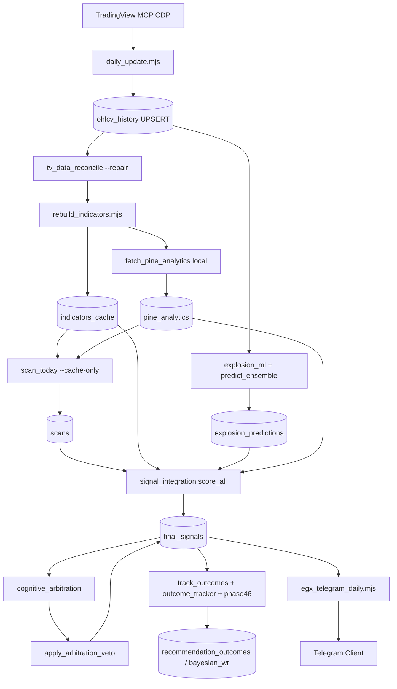

# EGX Data Flow

End-to-end path from TradingView to client Telegram.

## Daily EOD flow



## Freshness gate

```
MAX(ohlcv_history.bar_time)
  → event_calendar staleness_trading_days(ref=Cairo, before 15:30 = prior day)
  → PASS if stale=0 (including market holidays)
```

## Scoring stack (UES → final_signals)

```
indicators_cache universe
  + scans (scorer.js rules)
  + explosion_score (ML)
  + breadth / regime / pine / quant_discovery / macro_edge
  → compute_ues()
  → quality_gate + TRADING_LESSONS hard gates
  → write_final_signal(actionable=0|1)
```

## Read paths by surface

| Surface | Reads from |
|---------|------------|
| `npm run egx:status` | OHLCV freshness, `indicators_cache`, `final_signals`, pine, WR |
| `egx_telegram_daily.mjs` | `final_signals`, orchestrator, `telegram_report.py` |
| `egx_client_report.py` | `final_signals` only |
| `fetch_alerts.mjs` | `final_signals.actionable=1` |
| MCP tools | Live TV chart (not DB signals) |

## Weekly / research paths (non-client)

```
night_lab.py / research_director.py
  → grid_runs → alpha_rankings → evolve → re-grid
  → score_all (research rescore — avoid after client send)
```

## Ops commands

```bash
npm run egx:daily              # full EOD pipeline
npm run egx:migrate            # apply DB migrations
npm test                       # offline suite (JS + Python, no TV)
npm run test:live              # E2E vs live TradingView CDP
npm run egx:validate -- --quick
```

See also: [RUNBOOK_DAILY.md](./RUNBOOK_DAILY.md), [LAYER_REGISTRY.md](./LAYER_REGISTRY.md).
